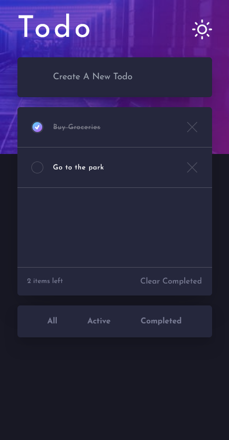
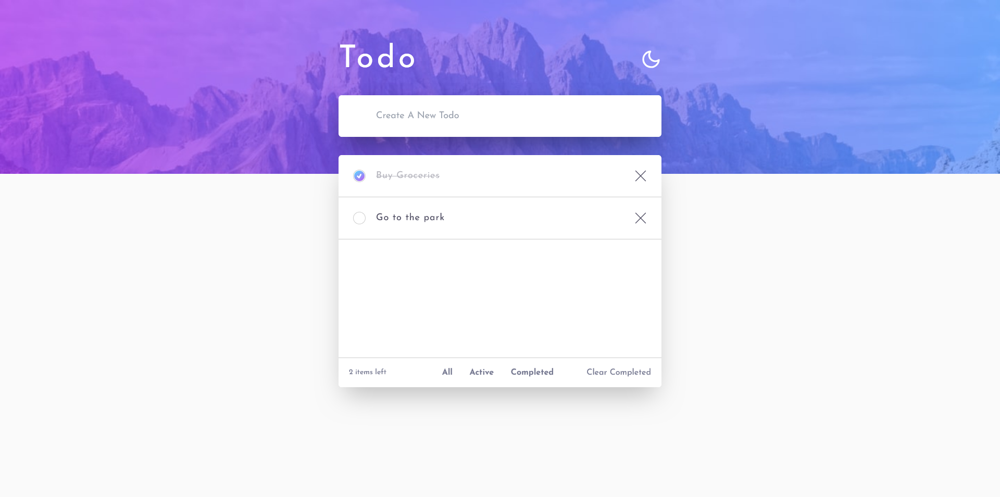
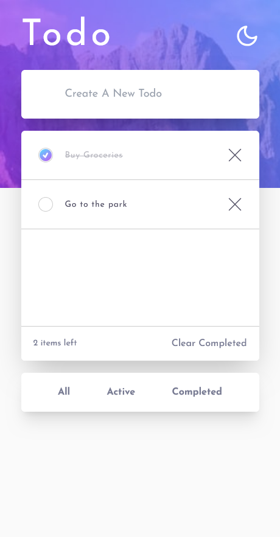

# Frontend Mentor - Todo app solution

This is a solution to the [Todo app challenge on Frontend Mentor](https://www.frontendmentor.io/challenges/todo-app-Su1_KokOW).

## Table of contents

- [Overview](#overview)
  - [The challenge](#the-challenge)
  - [Screenshot](#screenshot)
  - [Links](#links)
- [My process](#my-process)
  - [Built with](#built-with)
  - [What I learned](#what-i-learned)
  - [Continued development](#continued-development)
- [Author](#author)

## Overview

### The challenge

Users should be able to:

- View the optimal layout for the app depending on their device's screen size
- See hover states for all interactive elements on the page
- Add new todos to the list
- Mark todos as complete
- Delete todos from the list
- Filter by all/active/complete todos
- Clear all completed todos
- Toggle light and dark mode

### Screenshot

### Links

- Live Site URL: [Live Site](https://todo-app-livid-mu-39.vercel.app/)

## My process

### Built with

- React.js
- Next.js
- Tailwindcss
- TypeScript

### What I learned

During this project through try and error, I learned a lot of important things like Redux, TypeScript and how to toggle between light mode and dark mode using tailwind.

### Continued development

I still want to add a lot of features like: let the user determine the start and end dates of every todo. Also, I want to add a drag and drop feature, and a lot of other ones.

## Author

- Website - [Ahmed Mekkawy](https://modern-portfolio-azure-rho.vercel.app/)
- Frontend Mentor - [@AhmedMekkawy27](https://www.frontendmentor.io/profile/AhmedMekkawy27)